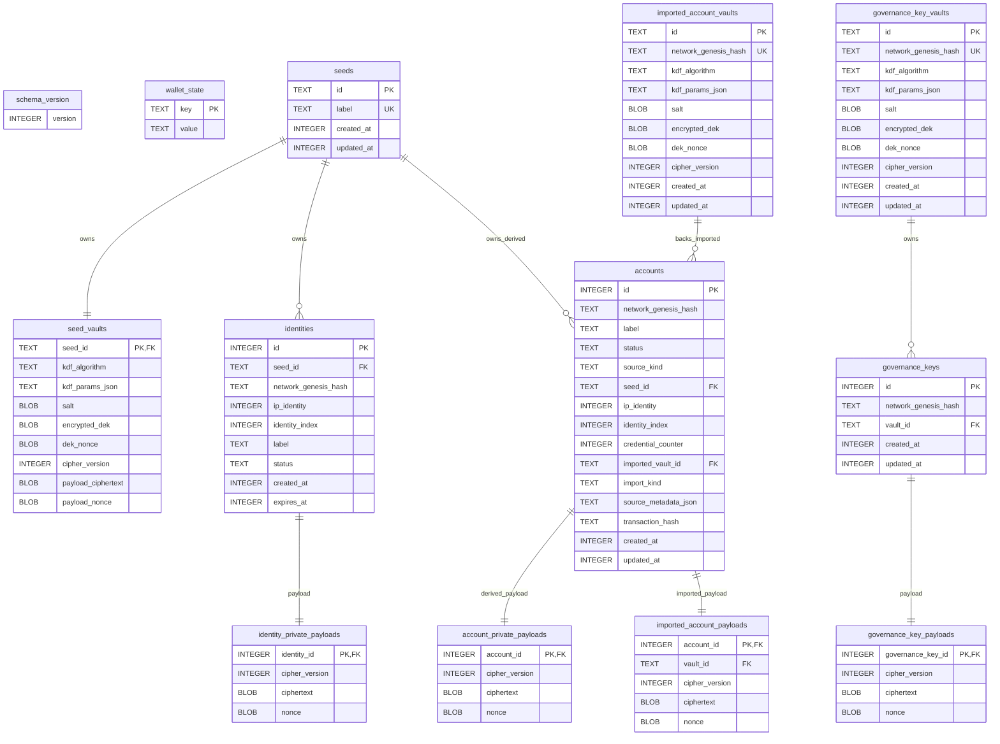
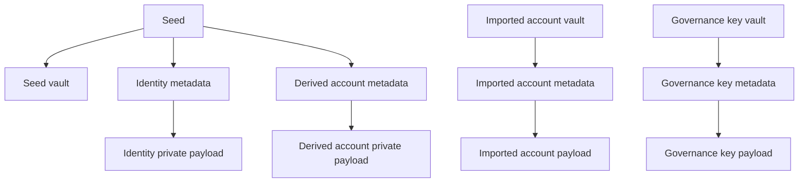

# Wallet DB Structure

This document describes the current wallet-local SQLite schema in `crates/ccd-wallet-core/src/store/migrations/001_initial_schema.sql`.

## Scope

This is a contributor reference for persisted local state only.
It documents the current schema shape, table relationships, ownership boundaries, uniqueness rules, and delete cascades.
It does **not** document chain interaction flows beyond the metadata that is stored locally.

## Design summary

The store follows a consistent split:
- plaintext metadata is kept in relational tables so the CLI can list, filter, rename, and scope entities without decrypting everything
- sensitive payloads live in separate encrypted payload or vault tables
- ownership is enforced with foreign keys and `ON DELETE CASCADE`
- network-scoped imported material is separated from seed-scoped material

## Entity relationship overview

## Ownership boundaries

## Table groups

### `schema_version`
Stores a single integer row describing the current schema baseline.
After consolidation, the baseline version is `1`.

### `wallet_state`
A small key/value table for wallet-local state that does not need its own entity model.

### Seeds
- `seeds` stores stable seed identity and user-facing metadata
- `seed_vaults` stores password-derived vault metadata and the encrypted seed payload

Key properties:
- `seeds.id` is the stable seed owner key used by child objects
- `seeds.label` is globally unique in the wallet
- deleting a seed cascades to its vault row

### Identities
- `identities` stores plaintext metadata used for lookup and usability checks
- `identity_private_payloads` stores the encrypted private identity payload

Key properties:
- unique tuple: `(network_genesis_hash, seed_id, ip_identity, identity_index)`
- unique per-network label: `(network_genesis_hash, label)`
- `expires_at` is promoted into plaintext metadata so account creation can pre-filter identities without decrypting every payload
- deleting an identity cascades to its private payload row
- deleting the owning seed cascades to both identity metadata and payload rows

### Accounts
The `accounts` table covers both derived and imported accounts.
The schema encodes this with `source_kind` plus a consistency `CHECK` constraint.

Derived accounts:
- carry `seed_id`, `ip_identity`, `identity_index`, and `credential_counter`
- use `account_private_payloads` for encrypted private data
- are unique by the partial index `accounts_derived_tuple_unique`

Imported accounts:
- carry `imported_vault_id`, optional `import_kind`, and optional `source_metadata_json`
- use `imported_account_payloads` for encrypted secret material
- do not require seed derivation metadata

Shared account rules:
- `(network_genesis_hash, label)` is unique across both derived and imported accounts
- account metadata is intentionally plaintext enough for listing, filtering, and rename flows
- deleting an account cascades to its source-specific payload row

### Imported account vaults
`imported_account_vaults` is network-scoped rather than seed-scoped.
There is at most one imported account vault per `network_genesis_hash`.

This separation matters because imported accounts are not derived from wallet seeds and must remain available even if an unrelated seed is deleted.

### Governance key vaults
`governance_key_vaults` and `governance_keys` mirror the imported-account pattern:
- one vault per `network_genesis_hash`
- metadata rows in `governance_keys`
- encrypted secret payload rows in `governance_key_payloads`

## Uniqueness rules

| Area | Rule |
|---|---|
| Seeds | `seeds.label` is globally unique |
| Identities | `(network_genesis_hash, seed_id, ip_identity, identity_index)` is unique |
| Identity labels | `(network_genesis_hash, label)` is unique |
| Accounts | `(network_genesis_hash, label)` is unique across derived and imported accounts |
| Derived accounts | `accounts_derived_tuple_unique` enforces uniqueness on `(network_genesis_hash, seed_id, ip_identity, identity_index, credential_counter)` for `source_kind = 'derived'` |
| Imported account vaults | `network_genesis_hash` is unique |
| Governance key vaults | `network_genesis_hash` is unique |

## Cascade behavior

The schema relies on SQLite foreign keys plus `PRAGMA foreign_keys = ON` at connection open.

Important cascades:
- deleting a seed deletes `seed_vaults`, `identities`, derived `accounts`, and the related private payload rows
- deleting an identity deletes `identity_private_payloads`
- deleting an account deletes either `account_private_payloads` or `imported_account_payloads`
- deleting an imported account vault deletes imported accounts attached to that vault and their encrypted payload rows
- deleting a governance key vault deletes its governance keys and encrypted payload rows

## Why the schema looks like this

The schema is optimized for CLI operations that need fast plaintext lookups while still keeping secrets encrypted at rest:
- selection and rename flows use plaintext metadata
- network and seed scoping use relational columns
- encrypted child payloads stay bound to the owning seed or vault domain

For the crypto details behind those payloads, see [`docs/encryption-model.md`](./encryption-model.md).
