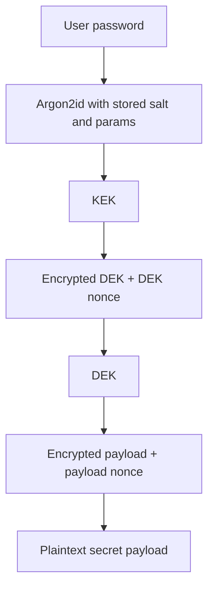
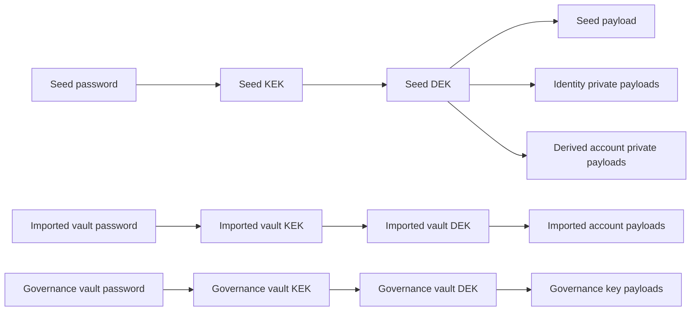
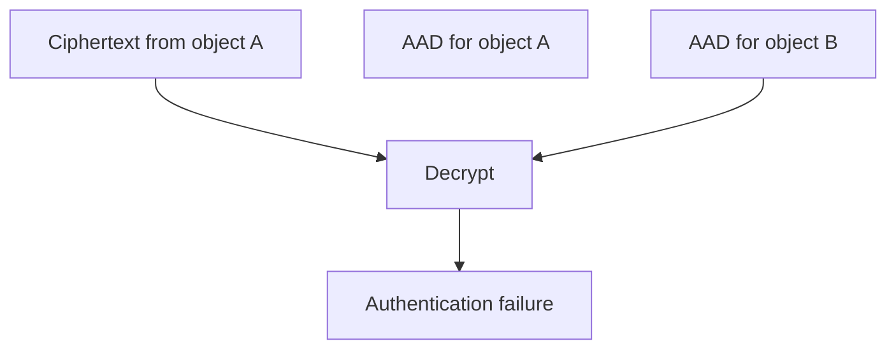

# Wallet Encryption Model

This document describes how wallet secrets are encrypted at rest in the local SQLite store.
It complements [`docs/db-structure.md`](./db-structure.md), which explains the relational layout.

## Scope

This document covers:
- password-derived key wrapping
- per-domain data encryption keys
- which data is plaintext vs encrypted at rest
- AAD binding strategy
- password change behavior for seed vaults

It does **not** describe network transport security or chain-level cryptography.

## Crypto primitives

The current implementation in `crates/ccd-wallet-core/src/store/crypto.rs` uses:
- **KDF:** Argon2id
- **AEAD:** ChaCha20-Poly1305
- **Key length:** 32 bytes
- **Nonce length:** 12 bytes
- **Salt length:** 16 bytes
- **Memory hygiene:** `Zeroizing<T>` for in-memory key and plaintext handling

Default Argon2 parameters:
- `m_cost = 65536`
- `t_cost = 3`
- `p_cost = 1`

## Encryption domains

The store has three password domains.
Each domain owns its own DEK and its own encrypted child payloads.

1. **Seed domain**
   - unlocked by the seed password
   - owns the seed secret itself
   - also owns identity private payloads and derived account private payloads

2. **Imported account vault domain**
   - unlocked by the imported-account-vault password for one network
   - owns imported account secret payloads for that network

3. **Governance key vault domain**
   - unlocked by the governance-vault password for one network
   - owns governance key JSON payloads for that network

## Envelope encryption flow

Operationally:
1. derive a KEK from the password, salt, and stored Argon2 parameters
2. decrypt the stored DEK with that KEK
3. use the DEK to decrypt or encrypt the actual secret payload

This lets password changes re-wrap the DEK without forcing all child payloads to be re-encrypted.

## Domain-specific flows

## Plaintext vs encrypted at rest

The store intentionally keeps enough metadata plaintext for normal CLI workflows while encrypting private material.

### Plaintext metadata

| Area | Plaintext at rest |
|---|---|
| Seeds | `id`, `label`, timestamps |
| Seed vault metadata | KDF algorithm, KDF params JSON, salt, encrypted DEK, DEK nonce, cipher version |
| Identities | owner seed id, network genesis hash, provider/index tuple, label, status, `expires_at`, timestamps |
| Accounts | network genesis hash, label, status, `source_kind`, derived tuple fields, imported vault reference, import metadata, transaction hash, timestamps |
| Imported account vaults | vault id, network genesis hash, KDF metadata, encrypted DEK metadata, timestamps |
| Governance key vaults | vault id, network genesis hash, KDF metadata, encrypted DEK metadata, timestamps |
| Governance keys | network genesis hash, vault id, timestamps |

### Encrypted payloads

| Encrypted object | Stored in |
|---|---|
| Seed secret bytes | `seed_vaults.payload_ciphertext` |
| Seed DEK | `seed_vaults.encrypted_dek` |
| Identity private payload (`code_uri`, identity object JSON) | `identity_private_payloads.ciphertext` |
| Derived account private payload (`AccountPrivatePayload`) | `account_private_payloads.ciphertext` |
| Imported account secret payload (address, signing material, credential metadata, optional encryption keys, source metadata) | `imported_account_payloads.ciphertext` |
| Imported-account vault DEK | `imported_account_vaults.encrypted_dek` |
| Governance key JSON payload | `governance_key_payloads.ciphertext` |
| Governance vault DEK | `governance_key_vaults.encrypted_dek` |

## AAD binding

Every AEAD operation uses object-specific Associated Additional Data created through `object_aad(id, kind, cipher_version)`.
That means ciphertext is authenticated not just against the key, but also against the expected object identity and context.

### Seed vault AAD
- seed DEK AAD: `<seed_id>:seed_dek:v1`
- seed payload AAD: `<seed_id>:seed:v1`

### Identity payload AAD
Identity payloads are bound to:
- identity row id
- network genesis hash
- seed id
- identity provider index
- identity index

Effective identity payload context:
- `<identity_id>:<network_genesis_hash>:<seed_id>:<ip_identity>:<identity_index>`

### Derived account payload AAD
Derived account payloads are bound to:
- account row id
- network genesis hash
- seed id
- identity provider index
- identity index
- credential counter

Effective derived account payload context:
- `<account_id>:<network_genesis_hash>:<seed_id>:<ip_identity>:<identity_index>:<credential_counter>`

### Imported account payload AAD
Imported account payloads are bound to:
- account row id
- network genesis hash
- imported vault id

Effective imported account payload context:
- `<account_id>:<network_genesis_hash>:<vault_id>`

### Governance key payload AAD
Governance key payloads are bound to:
- governance key row id
- network genesis hash
- vault id

Effective governance key payload context:
- `<governance_key_id>:<network_genesis_hash>:<vault_id>`

## Why AAD matters

AAD prevents ciphertext transplantation.
Copying encrypted bytes from one row into another row or vault context should fail authentication because the bound identity changes.

## Password changes

For seeds, password changes re-encrypt the DEK only:
- unlock existing DEK with the old password-derived KEK
- derive a new KEK from the new password and a new salt
- re-encrypt the same DEK under the new KEK
- leave the encrypted seed payload unchanged

This keeps password rotation proportional to vault count rather than payload count.

## In-memory handling

Secret material is wrapped in `Zeroizing<T>` where the store code handles:
- KEKs
- DEKs
- decrypted plaintext payload bytes

That does not make secrets impossible to observe in every runtime scenario, but it does ensure the code explicitly overwrites sensitive buffers on drop instead of leaving them in heap memory longer than necessary.

## Contributor checklist for future changes

When adding a new encrypted object, keep the current pattern:
1. store query/filter metadata in plaintext only when operationally necessary
2. encrypt private payloads under the correct ownership domain
3. bind ciphertext to stable object identity with AAD
4. store `cipher_version` with ciphertext so future migrations can evolve formats
5. use zeroizing wrappers for decrypted key material and plaintext buffers
